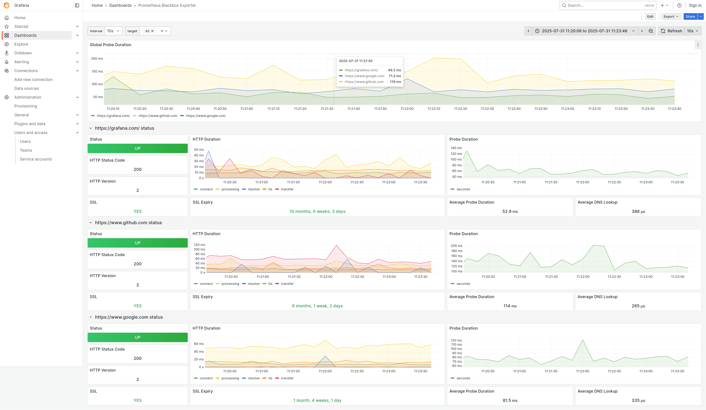

# Baseflow Oxybox: A Lean Multi-Tenant Monitoring Solution

Baseflow Oxybox is a lightweight and simplified alternative to the [Prometheus
Blackbox Exporter](https://github.com/prometheus/blackbox_exporter), designed
specifically for multi-tenant environments. It streamlines endpoint monitoring
by directly integrating with Mimir, eliminating the overhead associated with
traditional Blackbox Exporter deployments.

Oxybox is compatible with the [Prometheus Blackbox Exporter Dashboard](https://grafana.com/grafana/dashboards/7587-prometheus-blackbox-exporter/)
and can be used as a drop in replacement for the Blackbox exporter and Prometheus


## Why Baseflow Oxybox? The Challenges of Multi-Tenant Monitoring

In multi-tenant setups, leveraging `organisationId` for monitoring presents
significant complexities with the Prometheus Blackbox Exporter. The conventional
approach often necessitates:

* **Multiple Prometheus Helm Chart Installations:** Each tenant typically
  requires its own Prometheus instance, leading to a proliferation of
  deployments within the cluster.
* **Bulky Integration with Grafana:** The Blackbox Exporter's reliance on
  Prometheus as an intermediary creates an overly complex data flow for
  visualization in Grafana.
* **Unnecessary Intermediary:** When Mimir is already in place as the central
  metrics store, routing monitoring data through Prometheus adds an redundant
  layer. Prometheus's role in this scenario is limited to calling Blackbox
  Exporter and then forwarding the results to Mimir.

This multi-layered architecture often results in an excessive number of
processes, contributing to increased operational burden and potential stability
issues within the cluster.

## Our Solution: Direct, Multi-Tenant Monitoring with Oxybox

Baseflow Oxybox addresses these challenges by offering a streamlined approach:

* **Single Container Efficiency:** A single Oxybox container can monitor all
  configured endpoints across multiple tenants.
* **Direct Mimir Integration:** Oxybox directly sends monitoring metrics to
  Mimir, complete with multi-tenancy enabled through `organisationId` tagging.
* **Reduced Operational Overhead:** By removing Prometheus as an intermediary,
  Oxybox significantly simplifies the monitoring stack, leading to fewer
  deployed components and a more robust, efficient system.

Oxybox aims to provide a leaner, more direct, and ultimately more reliable
solution for endpoint health checks in complex, multi-tenant infrastructures.

## 🔧 Configuration Overview

Oxybox supports two layers of configuration:

1. **Application Configuration** – Controlled via environment variables.
2. **Probe Configuration** – Defined in a YAML file to specify target endpoints per organization.

---

### 📝 Probe Configuration (YAML)

The probe configuration file defines how Oxybox should monitor endpoints per organization. Below is an example configuration:

```yaml
demo:
  organisation_id: demo
  polling_interval_seconds: 10
  targets:
    - url: https://www.google.com
    - url: https://www.github.com
      accepted_status_codes: [200, 301]
    - url: https://grafana.com/

organisationX:
  organisation_id: another-org
  polling_interval_seconds: 20
  targets:
    - url: http://www.example.com
```

Each top-level key (e.g., `demo`, `organisationX`) represents a distinct probe group. The configuration allows you to define:

* `organisation_id`: Logical identifier for the organization.
* `polling_interval_seconds`: Interval between health checks (in seconds).
* `targets`: List of endpoints to monitor.
  * `url`: The target URL.
  * `accepted_status_codes` (optional): A list of HTTP status codes considered successful.

---

### 🌍 Application Configuration (Environment Variables)

The following environment variables can be used to configure Oxybox’s runtime behavior:

| Name             | Example Value                                  | Default Value           |
| ---------------- | ---------------------------------------------- | ----------------------- |
| `CONFIG_FILE`    | `example-config.yml`                           | `config.yml`            |
| `DNS_HOSTS`      | `8.8.8.8, 1.1.1.1`                             | `1.1.1.1, 8.8.8.8`      |
| `MIMIR_ENDPOINT` | `http://mimir.grafana.svc.cluster.local:9090/` | `http://localhost:9009` |

These can be defined in a `.env` file or passed directly through your environment.
